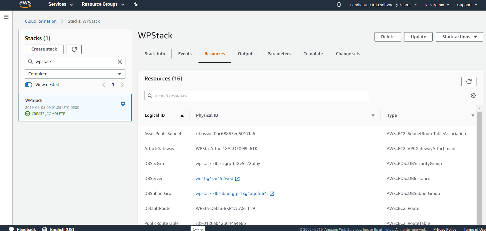
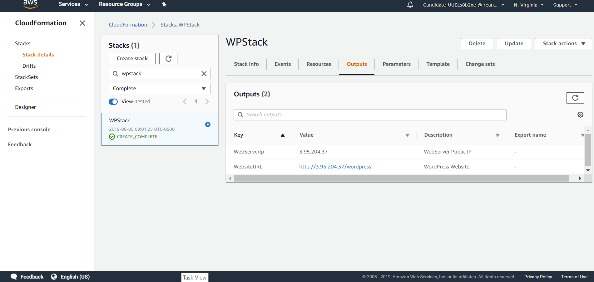
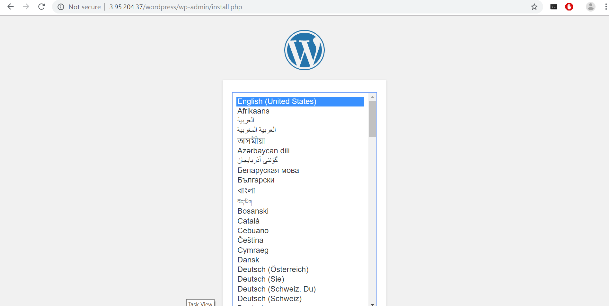

## Deploying Wordpress Site using Ansible and CloudFormation

An EC2 Instance is initially provisioned via the AWS console. An IAM role, is created and assigned to the instance, which gives it Admin Access to call other AWS services (i.e CloudFormation, VPC etc.). This instance is used as my ansible server; where my playbook is used to create the cloudformation stack that hosts the Wordpress site.  On this server, the following prerequisites were installed to run an ansible playbook:

- git
- python34
- boto3
- ansible

Programmatic access is also granted to the ansible server via the Access and secret keys provided.

The stack includes the following:

  - 1 VPC
      - Creates a default "Main Route Table", "Security Group", "Network ACL"
  - 1 Public Subnet inside the VPC
  - 2 Private Subnets inside the VPC  
  - 2 additional Security Groups (One for WebServer, One for DB Instance)
      - DBSecGroup : Allows traffic only on DB port
      - WebServerSecGroup : Allows traffic on SSH (22) and HTTP(80) ports   
  - 1 EC2 Instance for WebServer ( Public Subnet )  
  - 1 RDS Instance for Wordpress Database ( Private Subnet )
  - 1 Interet Gateway
  - 1 Route Table and 1 Route for the internet attached to the Public Subnet


A playbook (wpstack.yml) is created locally on the ansible server (also present in repository).

The cloudformation template used to create the stack is stored on an S3 Bucket. The template can be found here:

```
https://candidate-uuels8b2xe.s3.us-east-2.amazonaws.com/WPStack.json
```

The stack is provisioned by running the following,

```
ansible-playbook /home/ec2-user/HV/wpstack.yml
```

Once the stack creation is complete, navigate to the Cloudformation page in the AWS console to see the resources created



... and  output (as specified in the .json template file)

 

the output url is initially resolved to the install url and the setup page is displayed as seen below



On completion of setup and installation, the page can be accessed via the link below

```
http://3.95.204.37/wordpress
```

### Conditions
Wordpress 5.1.1 was chosen for installation due to its support of the lower PHP version installed on the webserver.
Ansible was chosen as the CM tool of choice due to personal preference. 
S3 was chosen as the cloudformation template host due to my preference of using mainly AWS services where possible. 

